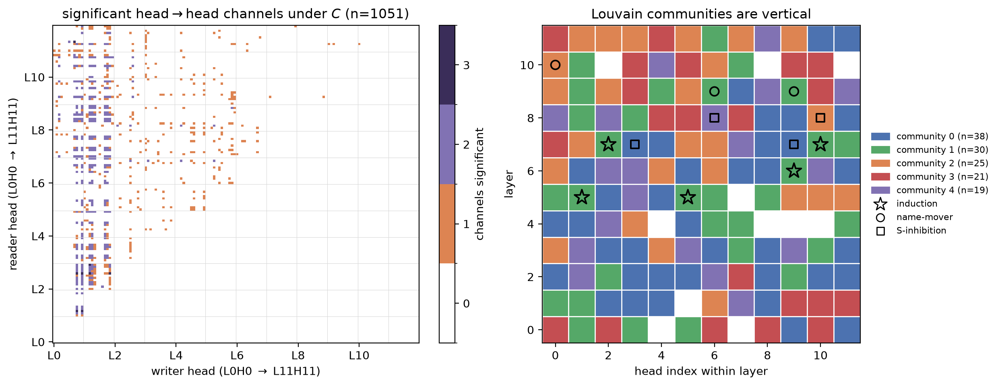

# The Communication Map of a Transformer

Code, results, and figures for the paper: [arXiv:2608.22007](https://arxiv.org/abs/2608.22007).

> **Abstract.** The components of a transformer communicate by writing to and reading from a shared residual stream, and mechanistic interpretability has mapped these connections by hand, one circuit at a time. We present the *communication map*, which charts every potential communication channel in a language model from weights alone, generalizing the composition score of Elhage et al. (2021) into a single *coupling coefficient* covering all 18 connection classes, from entire attention head circuits to single neurons. The census of all candidate channels, from 6.3x10^8 in GPT-2 to 1.3x10^11 in Pythia-6.9B, finds that 70-89% of head pairs are oriented far from chance, some coupled strongly and others actively avoiding each other. The full map costs 15 seconds for GPT-2 and 11 minutes for Pythia-6.9B on one consumer GPU. Two applications demonstrate the utility of the map. In Application 1, the strongest head-to-head couplings recover the known induction circuits blind and group them into communities, and ablating one such community destroys the model's in-context copying. In Application 2, pooling every head's coupling coefficients identifies a distinct two-dimensional stream subspace, whose deletion abolishes the induction capability in six models up to Pythia-6.9B. This subspace is different from those identified by either activation PCA or outlier dimensions. We release the map, the statistical machinery, and the intervention suite.



## This repository The repository mirrors the
paper's structure: the **general map** scores every potential
communication channel in a language model from weights alone and
censuses the scores against the theoretical rotation null
distribution; **Application 1** selects the strongest head-to-head
couplings and tests the resulting communities by ablation;
**Application 2** finds and deletes an induction-critical stream
subspace.

The repository has two content trees: `experiments/` holds every line
of code (scripts prefixed by their role, plus the `lib/commap` library
they share), and `results/` holds every generated artifact, one
subtree per producer. Scripts run from the repository root, read only
code, model hubs, and upstream results, and write only under
`results/`.

## Requirements

One CUDA GPU (all experiments fit comfortably on a single consumer card)
and [uv](https://docs.astral.sh/uv/). Python dependencies resolve from
`pyproject.toml` / `uv.lock`; on Linux, uv selects the CUDA 12.8 torch
wheel automatically. Plain `pip install -e .` works too (install torch
for your CUDA version first).

## Reproduce everything

```
uv run python experiments/run_all.py
```

Roughly 80 GPU-minutes end to end. `--stages map,app1` runs a subset;
`--list` prints the stage catalog. Every stage is also a standalone
script runnable on its own from the repository root.

One universal builder produces the map and census for every model.
The run_all `map` stage covers GPT-2; the larger models are direct
invocations of the same two scripts:

```
uv run python experiments/map_build.py gpt2
uv run python experiments/map_build.py pythia-2.8b
uv run python experiments/map_build.py pythia-6.9b --stream-load
uv run python experiments/app1_select.py pythia-2.8b
uv run python experiments/app2_scale.py pythia-6.9b --batch 4
```

The 6.9B runs need a 32 GB GPU (fp32 forwards) and ~45 GB RAM; the
2.8B runs fit smaller cards.

## Layout

```
experiments/
  run_all.py           single entry point (stages map, app1, app2,
                       verify, test)

  map_build.py         THE general map: coupling coefficient C for all
                       18 classes (GPU factored traces, fixed seeds),
                       the theory census (closed-form rotation-null
                       moments), interface rotation rankings, the
                       neuron wires; no selection
  map_crosscheck.py    independent CPU implementation of the head C
                       tables, retained as a cross-check
  map_fig_wires.py     Figure 3 (neuron cosine distribution vs the
                       exact chance law)

  app1_select.py       Application 1's selection standard: empirical
                       null distributions (median/MADN per stratum) +
                       per-class BH at q = 0.05, head classes only
  app1_communities.py  Louvain partition of the selected head graph;
                       archives the seed-0 assignment
  app1_fig_map.py      Figure 2 (head map + communities)
  app1_ablation.py     the induction-community decomposition (GPT-2)
  app1_seed_check.py   corpus-seed stability of the decomposition
  app1_multimodel.py   the four-model community-ablation replication

  app2_fig_bands.py    Figure 4 (pooled coupling matrix spectrum)
  app2_pilot.py        band selection rule + baseline deletions, per
                       model (arg: model name, seed)
  app2_scale.py        the deletions at scale, HF-native fp32 forwards
                       with a dose curve
  app2_overlaps.py     principal cosines, RW-PCA plane vs the
                       activation-PCA / outlier planes
  app2_rule_robustness.py      threshold-free selection variants pick
                       the identical pair on all six models
  app2_profile_samplesize.py   position-profile sample-size sweep

  verify_mc_nulls.py   Monte Carlo confirmation of the chance level
                       and the rank-one law (Appendix A)
  verify_both_sides.py both-sides bound spot check (Appendix A)
  verify_null_estimators.py    robust-vs-moment null-fit comparison
                       (Appendix A.4)
  verify_census_mc.py  500-rotation Monte Carlo census, asserted
                       against map_build's closed-form census
  verify_null_shape.py sampled rotation null of one head pair: shape
                       statistics + the appendix z-histogram figure
  verify_precision.py  why fp32: bf16/fp16 forwards distort the
                       induction-gain readout
  verify_stream.py     bit-exactness check of the streamed loader
  test_pipeline_synthetic.py   synthetic ground-truth pipeline test

  lib/                 shared harnesses (app1/app2 ablations) and the
                       pipeline library lib/commap: weights,
                       statistics, nulls, FDR, streaming edge scoring
results/
  map/{model}/         map_build outputs: head_C.csv.gz (raw head
                       C tables), theory_census.json, families.csv
                       (candidate census), wires.csv.gz, nn_hist.npz,
                       top-edge tables, summary.json
  app1/                app1_select outputs per model
                       ({model}/edges_heads.csv.gz, selection.json),
                       communities, decomposition JSONs, the archived
                       reference community (demoB_v2.json)
  app2/                pilot JSONs per model/seed,
                       {model}/cs2_dose.json, overlaps.json
  verification/        verify_* outputs + the CPU crosscheck map
  figures/             generated figures; the paper includes them here
paper/                 LaTeX source (not part of the code release)
```

## Where each paper number comes from

| Paper item | Produced by | Stored in |
|---|---|---|
| Census table (Section 3) | map_build (all models) | `results/map/{model}/theory_census.json` |
| Neuron wires, exceedance counts, Figure 3 | map_build + map_fig_wires | `results/map/{model}/wires.csv.gz`, `theory_census.json` (`nn_exceedance`), `results/figures/` |
| Candidate census (Tables 5, 6) | map_build | `results/map/{model}/families.csv` |
| Selected edges, thresholds (Section 4) | app1_select | `results/app1/{model}/edges_heads.csv.gz` |
| Figure 2, layer-separation table | app1_communities + app1_fig_map | `results/figures/`, `results/app1/` |
| Community decomposition (Table 2) | app1_ablation (+ seed check) | `results/app1/decomposition_gpt2*.json` |
| Appendix C table (four models) | app1_multimodel | `results/app1/decomposition_multimodel.json` |
| Deletion table (Table 1), small models | app2_pilot | `results/app2/cs2_pilot_*.json` |
| Deletion table, 2.8B/6.9B + dose curves | app2_scale | `results/app2/{model}/cs2_dose.json` |
| Deletion table cosine columns | app2_overlaps | `results/app2/overlaps.json` |
| Appendix A checks | verify_* | `results/verification/` |
| Appendix null-shape figure | verify_null_shape | `results/figures/fig_null_z_hist.png`, `results/verification/null_shape_gpt2.json` |

Two neuron-wire co-activation measurements (Section 3 census) are
reported from archived analysis
(`results/verification/crosscheck/wires_cos05.csv` holds the wire
list); the weight-side wire numbers all regenerate from map_build.

## Notes

- Corpora: repeated uniform-random 128-token blocks (fixed seeds) and a
  fixed public slice of pile-10k, both constructed in
  `experiments/lib/`.
- Eigensolver caveat: near-degenerate eigenvalues make band *indices*
  solver-dependent; the selection rule of Application 2 is stated on
  coupling shares (position specificity) and is unaffected.

## License

MIT (see LICENSE).

## Citation

If you use the map, the statistics, or the intervention suite, please cite:

```bibtex
@article{wang2026communicationmap,
  title={The Communication Map of a Transformer},
  author={Wang, Richard Zhe},
  journal={arXiv preprint arXiv:2608.22007},
  year={2026}
}
```
